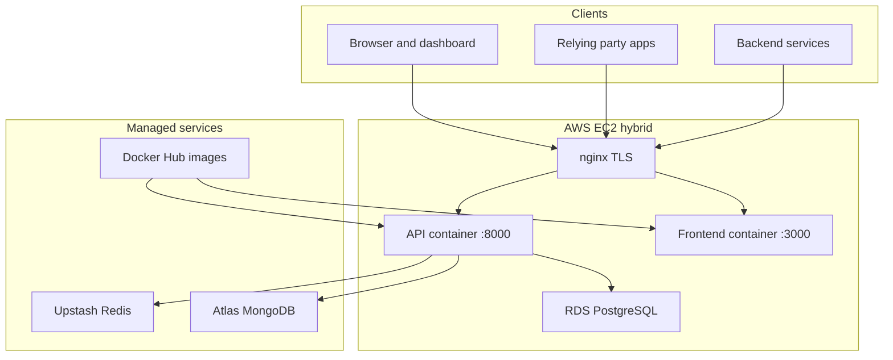
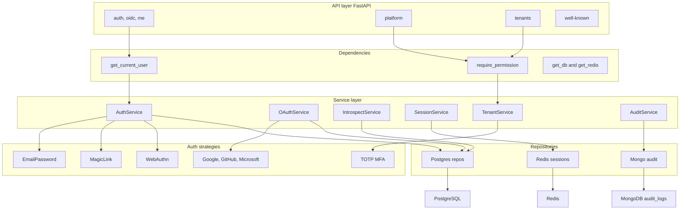
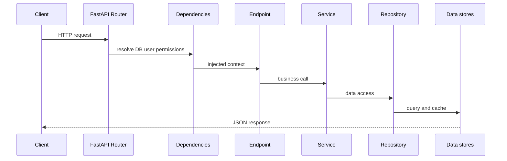
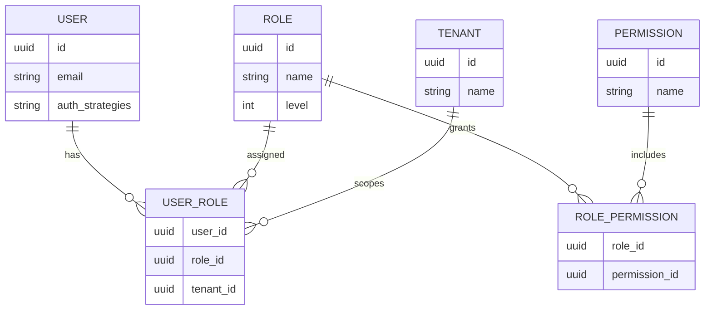

# Architecture

AuthEngine is a **single FastAPI service**: one process owns IAM, tenancy, OIDC, and audit. The dashboard is a separate Next.js app. External services validate tokens via introspection.

!!! abstract "Contents"
    **1** System diagram → **2** Components → **3** Backend layers → **4** Design principles → **5** Request lifecycle → **6** Data stores → **7** Multi-tenancy → **8** Code layout → **9** Frontend → **10** Production topology

---

## 1. High-level system diagram



## 2. Component responsibilities

| Component | Repository | Responsibility |
|-----------|------------|----------------|
| API service | `auth-engine` | Auth, RBAC, OIDC, tenant config, introspection |
| Dashboard | `auth-engine-dashboard` | Platform/tenant admin UI, user self-service |
| Infrastructure | `auth-engine-infra` | Terraform, Docker Compose, VPC, EC2, RDS, documentation |

## 3. Backend internal architecture



## 4. Design principles

**Strategy pattern** — Each auth method implements `BaseAuthStrategy` (`authenticate`, `validate`). New providers do not modify existing strategies.

**PBAC with level hierarchy** — Endpoints check permission strings (e.g. `tenant.users.manage`), not role names. Role `level` (0–100) blocks assigning equal-or-higher roles.

**Repository pattern** — Services contain business logic; repositories own SQLAlchemy, Motor, and Redis access.

## 5. Request lifecycle



Audit writes to MongoDB are fire-and-forget from the caller’s perspective.

## 6. Data stores

| Store | Technology | Contents |
|-------|------------|----------|
| PostgreSQL | RDS (prod) / Compose (local) | Users, roles, permissions, tenants, OAuth accounts, OIDC clients, API keys, configs |
| Redis | Upstash (prod) | Sessions, token blacklist, OAuth state, magic-link JTIs, MFA pending, rate limits, WebAuthn challenges |
| MongoDB | Atlas (prod) | Append-only `audit_logs` |

### Redis key patterns

| Pattern | Purpose |
|---------|---------|
| `session:{user_id}:{session_id}` | Active sessions |
| `blacklist:{jti}` | Revoked access tokens |
| `oauth:state:{token}` | OAuth CSRF state (~10 min) |
| `magic:jti:{jti}` | One-time magic links (~15 min) |
| `mfa:pending:{user_id}` | Post-login MFA step (~5 min) |
| `ratelimit:{ip}:{minute}` | Per-IP rate limiting |
| `webauthn:reg:{user_id}` | Registration challenge |
| `webauthn:auth:{challenge}` | Authentication challenge |

## 7. Multi-tenancy model



A user can hold different roles in different tenants via multiple `UserRole` rows. Tenant-scoped API paths include `{tenant_id}`; guards evaluate permissions in that tenant context.

## 8. API module layout (`auth_engine`)

```
src/auth_engine/
├── api/v1/          # Routers: public, platform, tenants, oidc, me, system
├── auth_strategies/ # email_password, oauth/*, magic_link, totp, webauthn
├── core/            # config, security, postgres, redis, mongodb, oidc_crypto
├── models/          # SQLAlchemy ORM
├── repositories/    # Data access
├── schemas/         # Pydantic request/response
├── services/        # Business logic
├── templates/       # OIDC login, email, SMS
└── main.py          # App entry, CORS, lifespan, /.well-known mount
```

## 9. Frontend architecture

- **Framework:** Next.js App Router, React, Zustand (`auth-store`)
- **HTTP:** Axios `apiClient` with Bearer token, `X-Tenant-Id`, automatic refresh on 401
- **Layouts:** `(auth)` for login flows; `(dashboard)/platform` and `(dashboard)/tenant` for admin
- **Security UI:** MFA and passkey management under `/me/security`

## 10. Production topology

Hybrid deployment on a single EC2 instance:

- **nginx** terminates TLS for `api.authengine.org`, `auth.authengine.org`, and `app.authengine.org`
- **API** and **frontend** run as Docker containers (`compose/docker-compose.prod.yml`)
- **RDS**, **Upstash**, and **Atlas** are external managed services

See [Deployment Guide](deployment.md) for DNS, `.env`, CI/CD, and nginx setup.

## Next

| Step | Guide |
|------|-------|
| Deploy this layout | [Deployment](deployment.md) |
| REST endpoints | [API Reference](api-reference.md) |
| Security controls | [Security Overview](security-overview.md) |
| OAuth / OIDC | [OAuth2 / OIDC Guides](oauth2-oidc-guides.md) |
