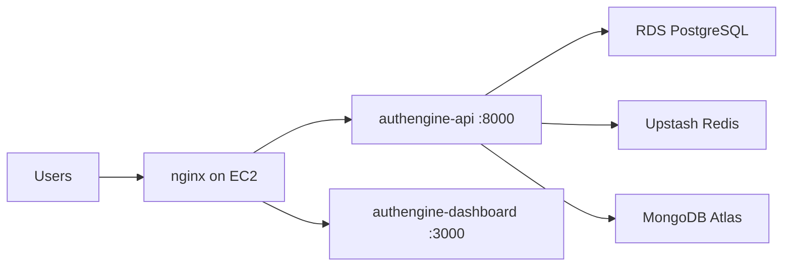

# Deployment Guide

Production uses a **hybrid layout**: AWS for compute (EC2) and PostgreSQL (RDS); **Upstash** for Redis and **MongoDB Atlas** for audit logs. API and dashboard run as **Docker containers on EC2**, fronted by **nginx** with TLS from Let's Encrypt.

!!! abstract "Deployment sequence"
    Complete phases **in order**:

    **1** Terraform → **2** DNS → **3** EC2 `.env` → **4** Containers → **5** nginx/TLS → **6** OAuth URIs → **7** CI/CD release → **8** Docs site → **9** Verify

---

## Platform URLs (production)

| Host | Role | Backend |
|------|------|---------|
| [authengine.org](https://authengine.org) | Product home | nginx → redirect to `app` |
| [api.authengine.org](https://api.authengine.org) | REST API, Swagger, `/.well-known` | nginx → `localhost:8000` |
| [auth.authengine.org](https://auth.authengine.org) | OIDC login UI and IdP endpoints | nginx → `localhost:8000` (same API process) |
| [app.authengine.org](https://app.authengine.org) | Admin dashboard | nginx → `localhost:3000` |
| [docs.authengine.org](https://docs.authengine.org) | This documentation | MkDocs on GitHub Pages |

## 1. Architecture overview

| Layer | Provider | Notes |
|-------|----------|-------|
| API | EC2 Docker (`authengine-api`) | Image `qniranjan01/authengine` on port 8000 |
| Dashboard | EC2 Docker (`authengine-dashboard`) | Image `qniranjan01/authengine-dashboard` on port 3000 |
| PostgreSQL | AWS RDS (`db.t4g.micro`) | Terraform-managed |
| Redis | Upstash | `rediss://` URL in `/opt/authengine/.env` |
| MongoDB | Atlas M0 | Audit logs; URI must include `/authengine` in path |
| TLS / routing | nginx + certbot on EC2 | Terminates HTTPS for `api`, `auth`, `app` |
| Docs | GitHub Pages | MkDocs build from `docs/` in this repo |

No NAT gateway or ALB in the default Terraform module (cost-optimized).



## 2. Phase 1 — Terraform

```bash
cd auth-engine-infra/terraform
cp terraform.tfvars.example terraform.tfvars
terraform init
terraform plan
terraform apply
```

### Resources created

- VPC with public subnet
- EC2 instance (`t4g.micro`) + Elastic IP
- RDS PostgreSQL (`db.t4g.micro`)
- ECR repository: `authengine-api` (optional; production uses Docker Hub `qniranjan01/authengine` and `qniranjan01/authengine-dashboard`)
- Security groups (API, RDS, optional SSH)
- IAM role for EC2 (ECR pull, SSM)

Key outputs: `ec2_public_ip`, RDS endpoint (see `outputs.tf`).

| Variable | Default | Purpose |
|----------|---------|---------|
| `aws_region` | `ap-south-1` | Region |
| `project_name` | `authengine` | Resource name prefix |
| `root_domain` | `authengine.org` | DNS reference |
| `db_password` | (required) | RDS master password |

**GitHub Actions:** `auth-engine-infra · Terraform Plan` → review → `auth-engine-infra · Terraform Apply`

## 3. Phase 2 — DNS

Point all application hosts at the EC2 Elastic IP from `terraform output ec2_public_ip`:

| Host | Type | Target |
|------|------|--------|
| `@` | A | EC2 Elastic IP (apex `authengine.org` → redirect to app) |
| `www` | A | Same Elastic IP (optional) |
| `api` | A | EC2 Elastic IP |
| `auth` | A | Same Elastic IP |
| `app` | A | Same Elastic IP |
| `docs` | CNAME | `q-niranjan.github.io` (GitHub Pages) |

Registrar: **Spaceship** (or any DNS host for `authengine.org`). Use TTL **300** during migration.

## 4. Phase 3 — EC2 application setup

Compose files: **`auth-engine-infra/compose/`**

### 4.1 Environment file

```bash
sudo mkdir -p /opt/authengine
sudo cp compose/env.prod.example /opt/authengine/.env
sudo nano /opt/authengine/.env
sudo chmod 600 /opt/authengine/.env
```

Required variables: `SECRET_KEY`, `JWT_SECRET_KEY`, `POSTGRES_URL`, `MONGODB_URL`, `REDIS_URL`, `APP_URL`, `DASHBOARD_URL`, `CORS_ORIGINS`, `SUPERADMIN_*`, `EMAIL_*`, `SMS_*`. Full list in `compose/env.prod.example`.

| Variable | Production value |
|----------|------------------|
| `APP_URL` | `https://auth.authengine.org` (IdP/issuer; used for OIDC + WebAuthn) |
| `DASHBOARD_URL` | `https://app.authengine.org` (used to build password-reset / verify-email links) |
| `CORS_ORIGINS` | `["https://app.authengine.org"]` |
| `MONGODB_URL` | Must include `/authengine` in the path (not `/?appName=...` only) |
| `REDIS_URL` | `rediss://` (Upstash TLS) |

> `APP_URL` and `DASHBOARD_URL` are distinct on purpose: `APP_URL` must stay the IdP domain (it is the OIDC issuer and WebAuthn RP ID), while `DASHBOARD_URL` is the frontend that renders the password-reset and email-verification pages.

### 4.1.1 Notifications — Email OTP (SES) and SMS OTP (Android gateway)

AuthEngine sends email (verification, password reset) and SMS (phone OTP) through pluggable providers selected by `EMAIL_PROVIDER` / `SMS_PROVIDER`.

**Email — Amazon SES** (`EMAIL_PROVIDER=ses`)

| Variable | Value |
|----------|-------|
| `EMAIL_PROVIDER` | `ses` |
| `EMAIL_SENDER` | `noreply@authengine.org` (must be a verified SES identity) |
| `AWS_REGION` | `ap-south-1` |
| `EMAIL_PROVIDER_API_KEY` | Leave **blank** to use the EC2 IAM role (recommended). Otherwise `"ACCESS_KEY_ID:SECRET_ACCESS_KEY"`. |

Setup:
1. `terraform apply` in `terraform/` creates the SES domain identity, Easy DKIM, a custom MAIL FROM, and grants the EC2 role `ses:SendEmail` (see `terraform/ses.tf`).
2. Add the DNS records from `terraform output ses_dns_records` (TXT `_amazonses`, 3 DKIM CNAMEs, MAIL FROM MX/SPF) at your DNS host. SES flips to **Verified** automatically.
3. New SES accounts are in the **sandbox** (can only send to verified addresses). Request production access: `terraform output ses_production_access_cli`, or set `request_ses_production_access = true`.

**SMS — Android phone + SIM gateway** (`SMS_PROVIDER=android_gateway`)

Runs the open-source "SMS Gateway for Android" app on a phone with a SIM; OTPs are sent off the existing SIM (no per-message fee).

| Variable | Value |
|----------|-------|
| `SMS_PROVIDER` | `android_gateway` |
| `SMS_GATEWAY_URL` | **Cloud** (required on EC2): `https://api.sms-gate.app/3rdparty/v1` · **Local** (same Wi-Fi only): `http://<phone-lan-ip>:8080` |
| `SMS_GATEWAY_USERNAME` / `SMS_GATEWAY_PASSWORD` | Basic-auth credentials shown in the app |

Notes:
- On EC2 you **must** use Cloud mode — the server cannot reach a phone's private LAN IP.
- Keep the app running with battery optimization disabled, SMS permission granted, and an SMS-capable SIM/plan.
- Phone numbers should be E.164 (`+91…`); bare 10-digit numbers are auto-prefixed with `+91`.

### 4.2 Optional OIDC RS256 key

```bash
sudo openssl genrsa -out /opt/authengine/oidc_private.pem 2048
UID=$(docker run --rm qniranjan01/authengine:1.0.0 id -u authengine)
sudo chown $UID:$UID /opt/authengine/oidc_private.pem
sudo chmod 400 /opt/authengine/oidc_private.pem
```

### 4.3 Start API and frontend

```bash
cd auth-engine-infra/compose
docker compose -f docker-compose.prod.yml pull
docker compose -f docker-compose.prod.yml up -d
```

Images: Docker Hub `qniranjan01/authengine` and `qniranjan01/authengine-dashboard`. Set `DOCKERHUB_USERNAME=qniranjan01` in GitHub Actions secrets. Override tag with `AUTHENGINE_IMAGE_TAG` / `AUTHENGINE_FRONTEND_IMAGE_TAG`.

### 4.4 Migrations

```bash
docker exec authengine-api auth-engine migrate
```

Run once per release after pulling a new API image.

## 5. Phase 4 — nginx and TLS

### 5.1 nginx reverse proxy

Create `/etc/nginx/conf.d/authengine.conf` on EC2:

Start with **HTTP only** (so nginx passes `nginx -t` before certs exist):

```nginx
# API + Auth → :8000
server {
    listen 80;
    server_name api.authengine.org auth.authengine.org;

    location / {
        proxy_pass http://127.0.0.1:8000;
        proxy_set_header Host $host;
        proxy_set_header X-Real-IP $remote_addr;
        proxy_set_header X-Forwarded-For $proxy_add_x_forwarded_for;
        proxy_set_header X-Forwarded-Proto $scheme;
    }
}

# Frontend → :3000
server {
    listen 80;
    server_name app.authengine.org;

    location / {
        proxy_pass http://127.0.0.1:3000;
        proxy_set_header Host $host;
        proxy_set_header X-Real-IP $remote_addr;
        proxy_set_header X-Forwarded-For $proxy_add_x_forwarded_for;
        proxy_set_header X-Forwarded-Proto $scheme;
    }
}

# Apex → app
server {
    listen 80;
    server_name authengine.org www.authengine.org;
    return 301 https://app.authengine.org$request_uri;
}
```

Test and reload:

```bash
sudo nginx -t
sudo systemctl reload nginx
```

Issue certificates (certbot adds `listen 443 ssl` blocks):

```bash
sudo certbot --nginx -d api.authengine.org -d auth.authengine.org
sudo certbot --nginx -d app.authengine.org
sudo certbot --nginx -d authengine.org -d www.authengine.org
```

After certs exist, ensure the apex block redirects over HTTPS:

```nginx
server {
    listen 443 ssl;
    server_name authengine.org www.authengine.org;
    ssl_certificate /etc/letsencrypt/live/authengine.org/fullchain.pem;
    ssl_certificate_key /etc/letsencrypt/live/authengine.org/privkey.pem;
    include /etc/letsencrypt/options-ssl-nginx.conf;
    ssl_dhparam /etc/letsencrypt/ssl-dhparams.pem;
    return 301 https://app.authengine.org$request_uri;
}
```

Verify:

```bash
sudo cat /etc/nginx/conf.d/authengine.conf
curl -I https://authengine.org
```

## 6. Phase 5 — OAuth redirect URIs

Register in each provider console:

```text
https://api.authengine.org/api/v1/auth/oauth/google/callback
https://api.authengine.org/api/v1/auth/oauth/github/callback
https://api.authengine.org/api/v1/auth/oauth/microsoft/callback
```

AuthEngine-as-provider callback for the dashboard:

```text
https://app.authengine.org/oauth/authengine/callback
```

## 7. Phase 6 — Frontend build variables

Baked into the Docker image at CI build time:

```env
NEXT_PUBLIC_API_URL=https://api.authengine.org/api/v1
NEXT_PUBLIC_APP_URL=https://app.authengine.org
```

Set these in `auth-engine-dashboard` GitHub Actions variables or Dockerfile build args before `docker compose pull`.

## 8. Phase 7 — CI/CD release

All workflows are **manual** (`workflow_dispatch`) unless you enable `on:` triggers in each workflow file.

### auth-engine (backend)

| Workflow | Purpose |
|----------|---------|
| auth-engine · Lint, Typecheck, and Docker Build | CI |
| auth-engine · Create Version Tag | Git tag (e.g. `v1.0.0`) |
| auth-engine · Build and Push Docker Image | Push to Docker Hub |
| auth-engine · Create GitHub Release | Release notes |
| auth-engine · Register Production Deployment | Deployment record |

**Secrets:** `DOCKERHUB_USERNAME`, `DOCKERHUB_TOKEN`

### auth-engine-dashboard

| Workflow | Purpose |
|----------|---------|
| auth-engine-dashboard · Lint and Build | CI |
| auth-engine-dashboard · Create Version Tag | Git tag |
| auth-engine-dashboard · Build and Push Docker Image | Push to Docker Hub |
| auth-engine-dashboard · Create GitHub Release | Release notes |
| auth-engine-dashboard · Register Production Deployment | Deployment record |

### 8.1 Full release order

1. **auth-engine-infra · Terraform Plan** → **Terraform Apply**
2. Configure Atlas + Upstash; write `/opt/authengine/.env`
3. **auth-engine:** CI → Tag → Build/Push → `docker compose pull` on EC2 → migrate
4. **auth-engine-dashboard:** CI → Tag → Build/Push → `docker compose pull` on EC2
5. Register deployments; publish docs (Phase 8 below)

---

## 9. Phase 8 — Documentation site (`docs.authengine.org`)

Docs are **MkDocs Material** Markdown in `auth-engine-infra/docs/`, built by GitHub Actions (`.github/workflows/docs-deploy.yml`). They are **not** served from EC2 — do **not** run certbot for `docs` on the instance. TLS is handled by **GitHub Pages**.

### Prerequisites

- `auth-engine-infra` repo is **public** (free GitHub Pages on private repos requires a paid plan)
- Latest `docs/`, `mkdocs.yml`, and workflow files are pushed to **`main`**

### 9.1 Enable GitHub Pages (GitHub Actions)

1. Open [auth-engine-infra Settings → Pages](https://github.com/auth-engine/auth-engine-infra/settings/pages)
2. **Build and deployment** → Source: **GitHub Actions** (not “Deploy from a branch”)
3. Push to `main` or run workflow **auth-engine-infra · Deploy docs** manually
4. Wait for the workflow to finish under **Actions**

After a successful deploy the site is available at `https://auth-engine.github.io/auth-engine-infra/` (interim URL).

### 9.2 Custom domain

1. In the same Pages settings, **Custom domain** → enter `docs.authengine.org`
2. Save — `docs/CNAME` in the repo should contain `docs.authengine.org`

### 9.3 DNS (Namecheap)

| Type | Host | Value |
|------|------|--------|
| CNAME | `docs` | `auth-engine.github.io` |

Use **CNAME only** for `docs` — do not add an A record for the same host.

Wait 15–60 minutes for propagation.

### 9.4 Enforce HTTPS

1. Return to Pages settings after DNS shows a green checkmark
2. Enable **Enforce HTTPS**
3. Wait 5–15 minutes for GitHub to issue the Let's Encrypt certificate

### 9.5 Verify docs site

```bash
dig +short docs.authengine.org
curl -I https://docs.authengine.org
```

Expected: DNS → `q-niranjan.github.io`, `HTTP/2 200`, padlock in browser.

Open:

- https://docs.authengine.org
- https://docs.authengine.org/deployment/
- https://docs.authengine.org/architecture/

### 9.6 Updating docs

Push changes to `docs/` or `mkdocs.yml` on `main` → the **Deploy docs** workflow rebuilds and publishes (usually 1–3 minutes).

### 9.7 Local preview

```bash
pip install -r requirements-docs.txt
mkdocs serve
```

Open `http://127.0.0.1:8000` before pushing.

### 9.8 certbot and docs — do not mix

| Host | TLS provider | Command |
|------|----------------|---------|
| `api`, `auth`, `app` | EC2 nginx + **certbot** | `sudo certbot --nginx -d api.authengine.org ...` |
| `docs` | **GitHub Pages** | Enable **Enforce HTTPS** in repo settings — no certbot |

Pointing `docs` at EC2 and running certbot there will conflict with GitHub Pages.

### 9.9 Docs troubleshooting

| Problem | Likely cause | Fix |
|---------|--------------|-----|
| Browser shows **Not secure** | Using `http://` or HTTPS not enabled yet | Open `https://docs.authengine.org`; enable **Enforce HTTPS** |
| **Enforce HTTPS** greyed out | DNS not verified | Fix CNAME `docs` → `q-niranjan.github.io`; wait; re-save custom domain |
| 404 on custom domain | Pages not built or wrong source | Confirm Pages source is **GitHub Actions**; check **Deploy docs** workflow succeeded |
| Site works on `github.io` URL but not custom domain | DNS missing or wrong | Only CNAME for `docs`; remove conflicting A record |
| Certificate error | Recently changed DNS | Wait up to 24h; toggle custom domain off/on in Pages |
| No sidebar / raw Markdown / broken Mermaid | Still using branch `/docs` Jekyll | Switch Pages to **GitHub Actions**; use MkDocs workflow |
| MkDocs build failed | Invalid `mkdocs.yml` or broken links | Check Actions log; run `mkdocs build --strict` locally |
| `dig` not found locally | `dnsutils` not installed | `sudo apt install dnsutils` or use [dnschecker.org](https://dnschecker.org) |

### 9.10 Alternative — Cloudflare Pages

1. Connect the `auth-engine-infra` repo in Cloudflare Pages
2. Build command: none; output directory: **`docs`**
3. Custom domain: `docs.authengine.org`
4. Namecheap CNAME `docs` → target shown by Cloudflare (`*.pages.dev`)

---

## 10. Phase 9 — Production verification

After CI/CD and DNS are complete, verify each host:

| Check | Command or URL |
|-------|----------------|
| API health | `curl https://api.authengine.org/api/v1/health` |
| Swagger | https://api.authengine.org/docs |
| OIDC discovery | `curl https://api.authengine.org/.well-known/openid-configuration` |
| Dashboard login | https://app.authengine.org/login |
| Docs site | https://docs.authengine.org |
| TLS on all hosts | Padlock in browser; no mixed content |

---

## Reference — Local vs production

| Item | Local (`compose/docker-compose.yml`) | Production |
|------|--------------------------------------|------------|
| `APP_URL` | `http://localhost:3000` | `https://auth.authengine.org` |
| CORS | `http://localhost:3000` | `https://app.authengine.org` |
| Databases | Postgres, Mongo, Redis in Compose | RDS + Atlas + Upstash |
| Images | Build from GitHub or pull | Pull from Docker Hub |
| TLS | Optional | Required (nginx + certbot) |

## Next

| Step | Guide |
|------|-------|
| Previous — local setup | [Quick Start](quick-start.md) |
| System design | [Architecture](architecture.md) |
| Hardening | [Security Overview](security-overview.md) |
