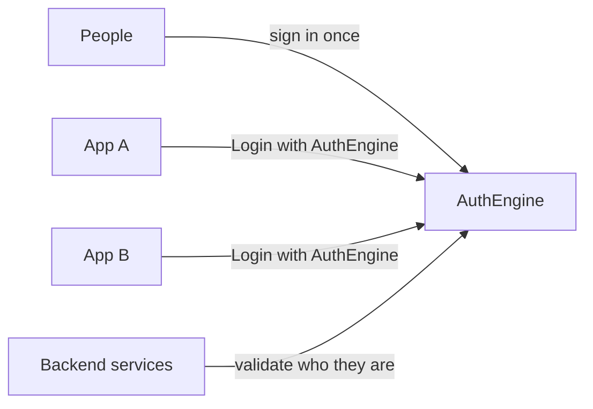

# AuthEngine

**One identity platform for all your apps and organizations.**

AuthEngine is the shared front door for your software ecosystem. People sign in once. Your CRM, APIs, dashboards, and partner apps all trust the same identity — who the user is, which organization they belong to, and what they are allowed to do.

Built for operators who run **more than one application** or **more than one customer organization** and need login, permissions, and audit to stay in one place.

[Read the full story →](about-author.md)

---

## Why central identity?

When every service builds its own login, permissions drift, secrets spread, and users juggle separate accounts. AuthEngine replaces that with **one system of record** for users, sessions, roles, and policies.

| Benefit | What it means for you |
|---------|----------------------|
| **One account, many organizations** | Users belong to multiple tenants with different roles |
| **Login with AuthEngine** | Browser and mobile apps use standard OpenID Connect |
| **Token validation for APIs** | Backend services verify sessions without sharing secrets |
| **Permissions in one place** | Roles and access rules defined once, enforced everywhere |
| **Policy per organization** | Each tenant chooses sign-in methods, MFA, and session rules |

!!! tip "Want the full picture?"
    See **[About](about-author.md)** for the problem breakdown, integration models, capabilities, and author details.

---

## Who it's for

| You are… | AuthEngine helps you… |
|----------|----------------------|
| **Platform operator** | Run tenants, service keys, and global user management |
| **Tenant admin** | Invite members, assign roles, configure login for your org |
| **App developer** | Add “Login with AuthEngine” or validate tokens in your API |
| **End user** | Sign in once with email, social, magic link, MFA, or passkeys |

---

## Get started

Follow this order based on your goal:

| Step | Guide | When to read |
|:----:|-------|--------------|
| **1** | [Quick Start](quick-start.md) | First time — run the stack locally |
| **2** | [Architecture](architecture.md) | Understand components and data flow |
| **3** | [Deployment](deployment.md) | Ship to production on AWS |
| **4** | [Security Overview](security-overview.md) | Harden tokens, sessions, and access |
| **5** | [API Reference](api-reference.md) | Integrate with REST endpoints |
| **6** | [OAuth2 / OIDC](oauth2-oidc-guides.md) | Social login or use AuthEngine as an IdP |

!!! tip "New here?"
    **[Quick Start](quick-start.md)** → **[Architecture](architecture.md)** → **[Deployment](deployment.md)**

!!! info "Building an integration?"
    **[API Reference](api-reference.md)** and **[OAuth2 / OIDC](oauth2-oidc-guides.md)** after Architecture.

---

## Production URLs

| Host | Role |
|------|------|
| [api.bestcrmhub.com](https://api.bestcrmhub.com) | REST API · [Swagger](https://api.bestcrmhub.com/docs) |
| [auth.bestcrmhub.com](https://auth.bestcrmhub.com) | Login and identity provider |
| [app.bestcrmhub.com](https://app.bestcrmhub.com) | Admin dashboard |
| [docs.bestcrmhub.com](https://docs.bestcrmhub.com) | This documentation |

**Local:** API `http://localhost:8000` · Dashboard `http://localhost:3000`

---

## Repositories

| Repository | Purpose |
|------------|---------|
| [auth-engine](https://github.com/Q-Niranjan/auth-engine) | Identity backend |
| [auth-engine-frontend](https://github.com/Q-Niranjan/auth-engine-frontend) | Admin dashboard |
| [auth-engine-infra](https://github.com/Q-Niranjan/auth-engine-infra) | Deployment and documentation |

---

## Quick reference

| Endpoint | URL |
|----------|-----|
| OIDC discovery | `GET https://api.bestcrmhub.com/.well-known/openid-configuration` |
| JWKS | `GET https://api.bestcrmhub.com/.well-known/jwks.json` |
| Token introspect | `POST https://api.bestcrmhub.com/api/v1/platform/service-keys/introspect` |
| Health | `GET https://api.bestcrmhub.com/api/v1/health` |

Introspection requires header `X-API-Key: ae_sk_<hex>`.
