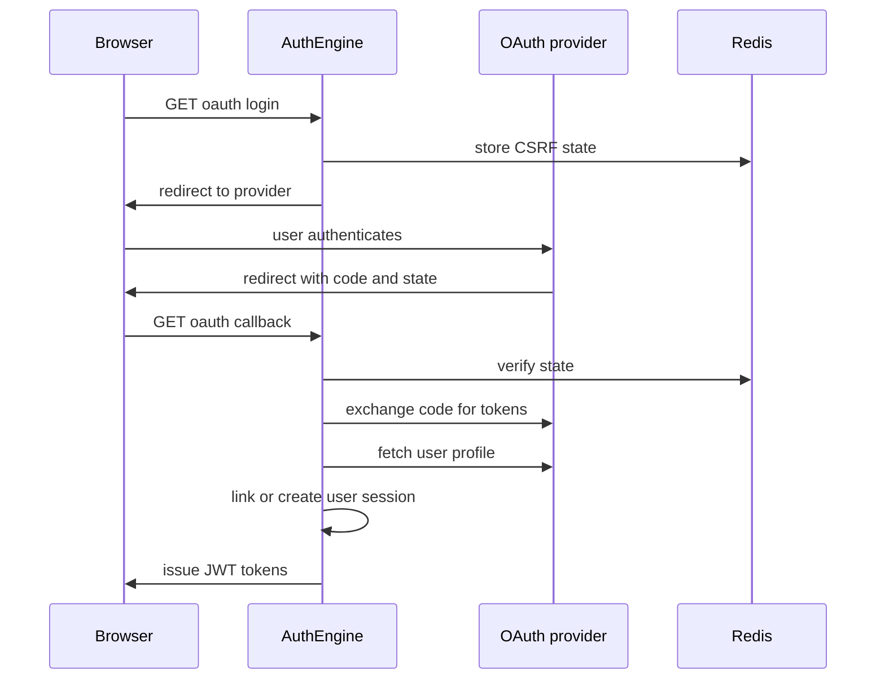

# OAuth2 / OIDC Guides

AuthEngine provides two OAuth-related capabilities:

1. **OAuth2 social login** — users sign in with Google, GitHub, or Microsoft; AuthEngine issues its own JWTs.
2. **OpenID Connect provider** — third-party apps use AuthEngine as an IdP via standard OIDC flows.

**Base URL:** `https://api.authengine.org/api/v1` (local: `http://localhost:8000/api/v1`)

!!! abstract "Contents"
    **Part A** Social login → **Part B** OIDC provider → **Part C** Service introspection

---

## Part A — Social login (OAuth2)

### Supported providers

| Provider | Start login | Callback |
|----------|-------------|----------|
| Google | `GET /auth/oauth/google/login` | `GET /auth/oauth/google/callback` |
| GitHub | `GET /auth/oauth/github/login` | `GET /auth/oauth/github/callback` |
| Microsoft | `GET /auth/oauth/microsoft/login` | `GET /auth/oauth/microsoft/callback` |

### Flow



### Configuration

Set provider credentials in backend `.env` (see `.env.example`). Production callback pattern:

```text
https://api.authengine.org/api/v1/auth/oauth/{provider}/callback
```

Leave `CLIENT_ID` empty to disable a provider.

### Linking providers to an existing account

Authenticated users can link another provider:

- `GET /auth/oauth/{provider}/link` — starts link flow
- `GET /auth/oauth/accounts` — lists linked providers

OAuth-only users can add a password via `POST /auth/set-password`, which adds `email_password` to `auth_strategies`.

### Frontend

The dashboard handles OAuth return at `/oauth/[provider]/callback` and stores tokens in the client auth store.

---

## Part B — AuthEngine as OIDC Provider

AuthEngine implements OIDC Discovery (RFC 8414), Authorization Code flow with PKCE (S256), dynamic client registration, and UserInfo.

### Discovery

Spec-required URL (app root, not under `/api/v1`):

```http
GET /.well-known/openid-configuration
```

Alias (same payload):

```http
GET /api/v1/oidc/openid-configuration
```

Example production URL: `https://api.authengine.org/.well-known/openid-configuration`

Key fields in the discovery document:

| Field | Value (pattern) |
|-------|-----------------|
| `issuer` | `JWT_ISSUER` (default `authengine`) |
| `authorization_endpoint` | `{base}/api/v1/oidc/authorize` |
| `token_endpoint` | `{base}/api/v1/oidc/token` |
| `userinfo_endpoint` | `{base}/api/v1/oidc/userinfo` |
| `jwks_uri` | `{base}/.well-known/jwks.json` |
| `registration_endpoint` | `{base}/api/v1/oidc/register` |
| `scopes_supported` | `openid`, `profile`, `email` |
| `response_types_supported` | `code` |
| `code_challenge_methods_supported` | `S256` |

Public keys: `GET /.well-known/jwks.json`

Set `APP_URL` in production so discovery URLs match your public IdP host (e.g. `https://auth.authengine.org` when reverse-proxied).

### Dynamic client registration

```http
POST /api/v1/oidc/register
Content-Type: application/json

{
  "client_name": "My Application",
  "redirect_uris": ["https://my-app.example.com/callback"],
  "token_endpoint_auth_method": "client_secret_post"
}
```

Supported token endpoint auth methods:

- `client_secret_basic` (default)
- `client_secret_post`
- `private_key_jwt` (register `jwks_uri` for client public keys)

### Authorization Code flow

**Step 1 — Authorize**

```http
GET /api/v1/oidc/authorize?
  response_type=code
  &client_id=<CLIENT_ID>
  &redirect_uri=https://my-app.example.com/callback
  &scope=openid profile email
  &state=<random>
  &code_challenge=<S256_challenge>
  &code_challenge_method=S256
```

Unauthenticated users see the login UI (`templates/oidc/login.html`). After login and consent, AuthEngine redirects:

```http
GET https://my-app.example.com/callback?code=<auth_code>&state=<random>
```

**Step 2 — Token exchange**

```http
POST /api/v1/oidc/token
Content-Type: application/x-www-form-urlencoded
Authorization: Basic <base64(client_id:client_secret)>

grant_type=authorization_code
&code=<auth_code>
&redirect_uri=https://my-app.example.com/callback
&code_verifier=<pkce_verifier>
```

Response includes `access_token`, `refresh_token`, and `id_token` (when `openid` scope requested).

**Step 3 — UserInfo**

```http
GET /api/v1/oidc/userinfo
Authorization: Bearer <access_token>
```

### ID token verification

- Fetch JWKS from `/.well-known/jwks.json`
- Verify signature (`RS256` when RSA keys configured; otherwise validate via token endpoint / UserInfo)
- Validate `iss`, `aud`, `exp`, and `nonce` if used

Cache JWKS (`Cache-Control: public, max-age=3600`) and refresh when an unknown `kid` appears.

### Logout

Discovery advertises `end_session_endpoint` → `/api/v1/auth/logout` for session termination.

---

## Part C — Service token introspection (OAuth2-adjacent)

Backend services validate user JWTs without holding `JWT_SECRET_KEY`:

```http
POST /api/v1/platform/service-keys/introspect
X-API-Key: ae_sk_<hex>
Content-Type: application/json

{
  "token": "<access_token>",
  "tenant_id": "<optional-uuid>"
}
```

Create API keys via platform admin: `POST /api/v1/auth/service-keys` (requires `platform.tenants.manage` or equivalent).

See [Security Overview](security-overview.md) for introspection steps and key handling.

---

## Next

| Step | Guide |
|------|-------|
| Endpoint details | [API Reference](api-reference.md) |
| System design | [Architecture](architecture.md) |
| Production DNS | [Deployment](deployment.md) |
| Token security | [Security Overview](security-overview.md) |
