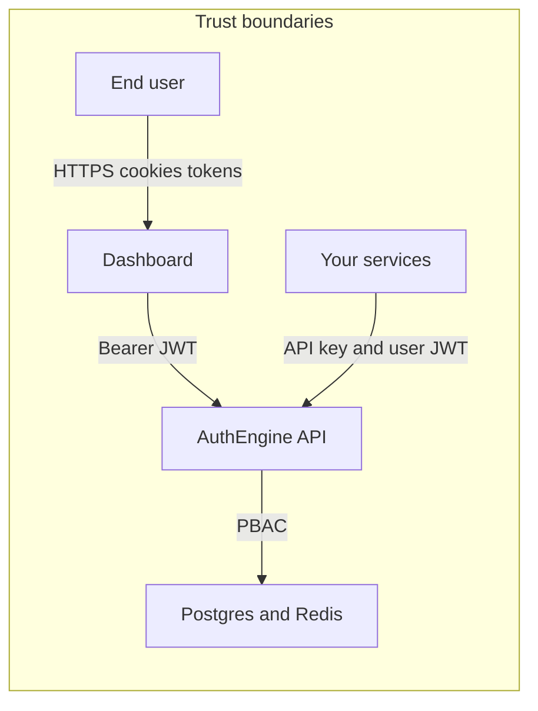

# Security Overview

AuthEngine is a central identity layer for multiple applications. This document summarizes threat-relevant controls. Pair it with [Deployment](deployment.md) for production hardening.

!!! warning "Found a vulnerability?"
    Report it privately — see [Security Policy](security-policy.md). Do **not** open a public GitHub issue.

!!! abstract "Contents"
    **1** Trust model → **2** Secrets → **3** Passwords → **4** Sessions → **5** MFA → **6** Magic links → **7** OAuth → **8** OIDC → **9** PBAC → **10** Rate limits → **11** Audit → **12** Network → **13** API keys → **14** Frontend → **15** Checklist

---

## 1. Security model at a glance

- **Users** authenticate via password, OAuth, magic link, TOTP, or WebAuthn.
- **Dashboard** stores access/refresh tokens client-side; refresh is automatic on 401.
- **Services** never receive `JWT_SECRET_KEY`; they call introspection with a service API key.

## 2. Credentials and secrets

| Secret | Usage | Storage |
|--------|-------|---------|
| `SECRET_KEY` | Fernet encryption (MFA secrets), app crypto | Env only, ≥32 chars |
| `JWT_SECRET_KEY` | HS256 access/refresh JWT signing | Env only, ≥32 chars |
| Service API keys | Introspection auth | SHA-256 hash in Postgres; raw shown once |
| OIDC client secrets | Token endpoint | Hashed / stored per client registration |
| Passwords | User login | Argon2 via passlib |

Generate production secrets with `openssl rand -hex 32`. Never commit `.env` or `terraform.tfvars`.

## 3. Password policy

Enforced at registration and password change:

- Minimum length (`PASSWORD_MIN_LENGTH`, default 8)
- Uppercase, lowercase, digit, special character (configurable booleans)
- Argon2 hashing (`SecurityUtils.hash_password`)

## 4. Sessions and tokens

### JWT access tokens

- Default TTL: 30 minutes (`ACCESS_TOKEN_EXPIRE_MINUTES`)
- Claims include user id, session id (`sid`), and type
- Validated on every protected route via `get_current_user`

### Refresh tokens

- Default TTL: 7 days (`REFRESH_TOKEN_EXPIRE_DAYS`)
- Tied to Redis session `session:{user_id}:{session_id}`
- Refresh fails if session deleted (logout) or evicted

### Session limits

- `MAX_CONCURRENT_SESSIONS` (default 5) — oldest session evicted when exceeded
- Logout deletes Redis session and can blacklist `jti` for immediate revocation

### Token introspection (6 steps)

`IntrospectService` returns `{ "active": false }` on any failure (no exception leakage):

1. Decode and verify JWT signature/expiry
2. Check `blacklist:{jti}` in Redis
3. Verify session exists in Redis
4. Load user from PostgreSQL
5. Require `status == ACTIVE`
6. Resolve permissions (optionally scoped to `tenant_id`)

Service keys may be tenant-scoped: a key bound to tenant A cannot introspect data for tenant B.

## 5. MFA (TOTP)

- Secret generated with `pyotp`, encrypted at rest with Fernet derived from `SECRET_KEY`
- Login returns **202** + `mfa_pending_token` when MFA enabled; Redis `mfa:pending:{user_id}` is one-time (~5 min)
- Enrollment requires confirming a valid code before `mfa_enabled` is set

## 6. Magic links

| Control | Mechanism |
|---------|-----------|
| Signed | HS256 JWT (`JWT_SECRET_KEY`) |
| Short TTL | 15 minutes default |
| One-time | Redis `magic:jti:{jti}` deleted on use |
| Enumeration-safe | `/request` always returns 202 |
| Email failure | Redis key rolled back if send fails |

## 7. OAuth2 social login

- CSRF `state` stored in Redis (`oauth:state:*`, ~10 min)
- Server-side code exchange only (no implicit flow for social login)
- Account linking rules: known provider account → update tokens; known email → link; else create user with verified email

## 8. OIDC provider

- Authorization Code + PKCE (S256 only)
- Supported client auth: `client_secret_basic`, `client_secret_post`, `private_key_jwt`
- ID tokens: prefer **RS256** with published JWKS for multi-tenant production; symmetric HS256 metadata is listed when RSA keys are not configured
- Discovery and JWKS cached with `Cache-Control: public, max-age=3600`

## 9. Authorization (PBAC)

Permissions are strings (e.g. `tenant.users.manage`), not role names. Guards:

- `require_permission(...)` — tenant routes (extracts `tenant_id` from path)
- `check_platform_permission(...)` — platform routes

**Level hierarchy** prevents lateral privilege escalation:

| Role | Level | Can manage levels |
|------|-------|-------------------|
| SUPER_ADMIN | 100 | 0–99 |
| PLATFORM_ADMIN | 80 | 0–79 |
| TENANT_OWNER | 60 | 0–59 |
| TENANT_ADMIN | 50 | 0–49 |
| TENANT_MANAGER | 30 | 0–29 |
| TENANT_USER | 10 | 0–9 |

`SUPER_ADMIN` is seeded at bootstrap and should not be assigned manually.

## 10. Rate limiting

When `RATE_LIMIT_ENABLED=true`, requests are limited per IP (`RATE_LIMIT_PER_MINUTE`, default 10) using Redis keys `ratelimit:{ip}:{minute}`.

## 11. Audit logging

Security-relevant actions are appended to MongoDB `audit_logs` with actor, tenant, resource, IP, and user agent. Platform and tenant admins query audit APIs with appropriate permissions.

## 12. Network and deployment

| Control | Recommendation |
|---------|----------------|
| TLS | Terminate HTTPS at proxy; use `rediss://` for Redis |
| CORS | Restrict `CORS_ORIGINS` to known dashboard origins |
| SSH | Prefer SSM; restrict `allowed_ssh_cidr` or leave empty |
| RDS | Security group allows Postgres only from EC2 |
| Secrets on EC2 | File permissions `600` on `/opt/authengine/.env` |

## 13. Service API keys

- Format: `ae_sk_<64 hex>`
- Only SHA-256 hash stored; `key_prefix` (12 chars) for UI display
- Revocation via `DELETE /auth/service-keys/{id}` — effective on next introspect call
- Optional `expires_at` for time-bound integrations

## 14. Frontend considerations

- Tokens held in client store (Zustand); protect against XSS in your deployment
- Automatic logout when refresh fails
- `X-Tenant-Id` sent only when a tenant is selected

## 15. Security checklist (production)

- [ ] Rotate `SECRET_KEY`, `JWT_SECRET_KEY`, and super admin password from defaults
- [ ] Enable TLS on all public endpoints
- [ ] Restrict CORS to `https://app.<domain>`
- [ ] Configure RS256 OIDC signing keys for external relying parties
- [ ] Issue per-service API keys with least privilege (tenant scope where possible)
- [ ] Register exact OAuth redirect URIs in provider consoles
- [ ] Disable unused OAuth providers (empty `CLIENT_ID`)
- [ ] Review RDS backups and Atlas/Upstash access controls
- [ ] Monitor audit logs for anomalous `platform.*` and `tenant.*` actions

## Next

| Step | Guide |
|------|-------|
| OAuth / OIDC setup | [OAuth2 / OIDC Guides](oauth2-oidc-guides.md) |
| API endpoints | [API Reference](api-reference.md) |
| Data flow | [Architecture](architecture.md) |
| Production deploy | [Deployment](deployment.md) |
